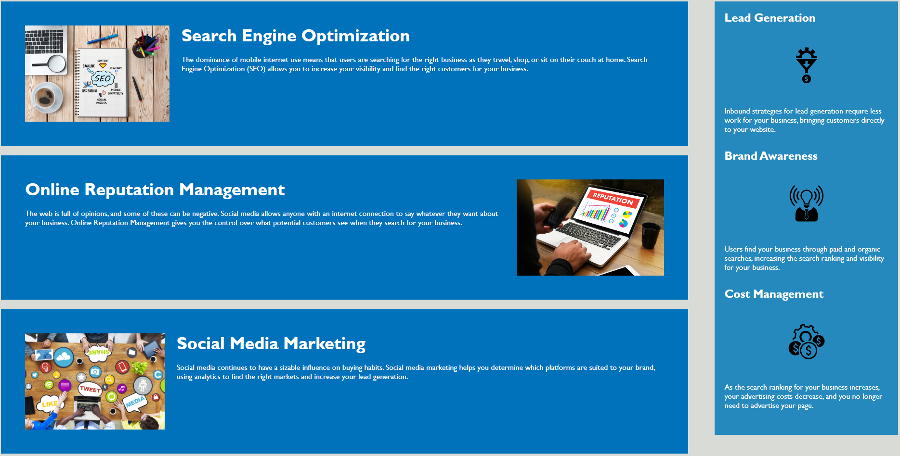

# Code Refactor Starter Code
# <Horiseon Landing Page>

## Description

This is the landing page for Horiseon Social Solution Services, Inc. The motivation and reason to work on this project was to further my skills as a web developer. Learning how to semantically setup HTML for a website, as well as stlying the website with CSS.

## Installation

N/A

## Usage

Screenshots below for the elements in HTML styled with CSS

The Header, Nav bar, and Hero styled and deployed.

The Body styled and deployed.

The Footer styled and deployed.

## Credits

Coded by Hank Richter while learning in the MSU Full Stack Bootcamp.
